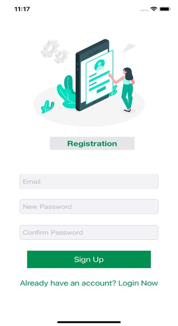
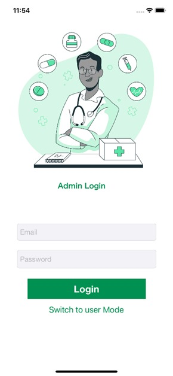
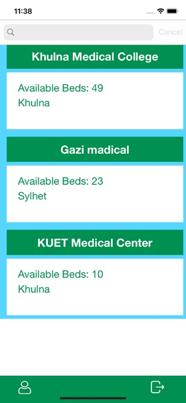
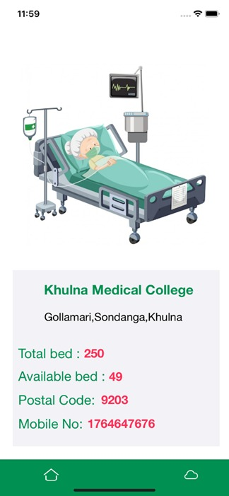
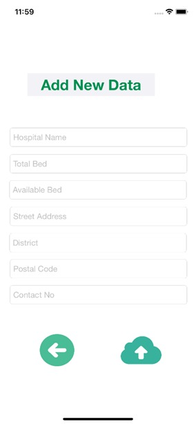

# ICU_Bed_Finder
ICU Bed Finder: A Beautiful and Minimalistic iOS App
# Objectives
1. **Help users locate and navigate to available ICU beds in their area**
2. **Provide up-to-date information on bed availability, occupancy rates, and wait times**
3. **Allow users to filter search results based on specific criteria such as hospital ratings and distance**
4. **Simplify the process of finding urgent medical care during times of need with a beautiful and minimalistic design**

# Two Distinct Roles
1. **Admin:**
   The responsibilities of Admin are to collect the data from the hospitals and Update these information in the database
2. **User:**
   The User has to create an account to get access to the database and can use the information

# Features

### User Features
- **Authentication**
  - Login
  - Signup
- **Contact**
  - Contact using phone number

### Admin Features
- **Hospital Management**
  - Control and edit hospital information
  - Manage ICU bed availability

# Screenshots

### Sign Up

### Log In

### List of the Hospitals

### Details of a hospital

### Add New Hospital

